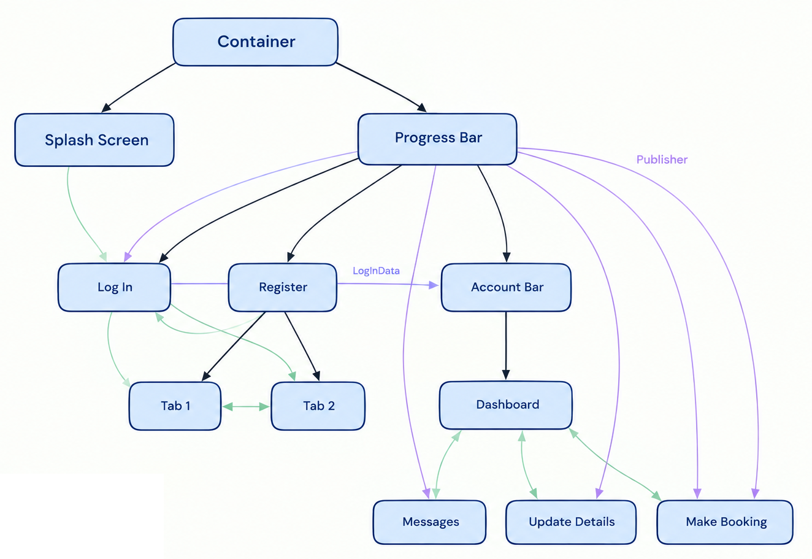

# Trellis
Trellis is a hierarchical UI composition and state-management / dependency injection framework.
A declarative tree of node elements forms the backbone of a user interface, reconciling modifications
with a dependent tree of display elements. Nodes host and scope the lifecycle of injection objects,
stateful components that descendents can source, read and communicate with.

Trellis does not depend on any particular UI framework. An additional module, `trellis-swing` is supplied
with some Java Swing-specific utilities.

## Overview

The implementer extends Node and/or MultiNode classes, using annotations to describe
parentage and which injection components are supplied by that Node, forming a tree. At any given
time, a single branch of the tree - a path from root to leaf - is active: its leaf is the _state_.

Any Node can issue a request for a change in state. This reconstructs the system of active Nodes,
retaining Nodes that appear in both, disposing of those that are no longer needed and constructing new
Nodes. Similarly, disposed Nodes retire their associated Injectables. This modification is then reconciled
with the system of display elements.

No particular user interface library is prescribed: an implementer only has to define classes that implement
an interface. Some generic implementations using Swing are provided, but optional.

## Example
See [example/](/example) for a demonstrative project. To run:
```
cd example
mvn compile
```

## Features
- **MultiNodes**: MultiNodes persist all of their children - and thus, their associated display and injectable elements. This is especially useful for scenarios like multi-pane forms, allowing each pane to retain local state without disposal and reconstruction whenever the tab changes. 
- **Injectable Bag**: When the tree changes state, the state change request can be accompanied by pre-constructed Injectable objects, which are caught and subsequently hosted by one or more Nodes in the new path. This allows changes in state to transfer data from one path into another, whilst still keeping everything scoped to what provides and consumes it.
- **Metadata Aggregation**: Nodes can contribute metadata, which is aggregated through the active path. The implementer can provide a custom aggregator to condense these into DigestComponents which are then propagated up the tree and consumed by Nodes.
- **Disposal Processing**: Nodes and Injectables to be disposed of are collected into a data structure. This can be iterated over in a variety of ways (depth-first or breadth-first; ascending or descending; Injectables then Nodes, or vice versa) for cases where the closing of objects must be performed in a particular order, due to dependencies on the existence of related objects. The implementer can also provide their own IDisposalProcessor to process this data directly.
- **Requests**: A Request propagates up the tree and can be caught by any active Node. 
- **Validation Rules**: Which Nodes and Injectables were discovered can be compared against a list of classes,
- **Enum Constants**: The Service can be configured with an enum and a paired reader, which is then scanned and cached. This allows Nodes, Injectables and DigestComponents to be described by an enum constant, rather than Class object, from any method. 

## Architecture
- **Configuration Pattern**: The Service provides a parameterless constructor, such that it can be hosted as a Singleton by any framework the implementer uses. Methods are blocked until the Service is configured with an AppServiceConfigurationBuilder.
- **Reflection Caching**: All Nodes and Injectables are discovered when the Service is configured, and scanned once, a digest containing all relevant information being retained thereafter.
- **Sophisticated Fault Diagnosis**: All significant errors throw an exception at the element where the error occurs, which is caught and wrapped in an exception at the element where the request originated.
- **Exception Boundary**: Wherever the library calls into a user-defined method, any exceptions thrown by that method are caught and wrapped into a custom exception type. 

## Installation
### Maven
If you have access to the published Maven artifact, add the following dependency for the library:

```
<dependency>
    <groupId>com.github.jjb-coding</groupId>
    <artifactId>trellis</artifactId>
    <version>1.0.0</version>
</dependency>
```

For Swing-specific extensions:

```
<dependency>
    <groupId>com.github.jjb-coding</groupId>
    <artifactId>trellis-swing</artifactId>
    <version>1.0.0</version>
</dependency>
```

### Building from source
Clone the repository. To build the core library:

```
cd library
mvn package
```

For Swing-specific extensions:
```
cd swing
mvn package
```

The example module demonstrates usage of the library. It is not required for use of the library.

## Documentation
See [documentation](https://jjb-coding.github.io/trellis/) for library documentation.

## Licence
Distributed under the MIT License.
